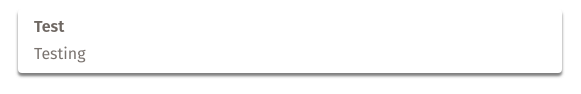

# Notification Framework

A simple library in JavaScript to create notifications within a webpage.




## Installation
Add the `notifications.css` and `notifications.js` files to your projects.

## Usage

To create a notification do the following:
```javascript
NotificationManager.create("Title", "Description");
```

To create a notification with a timeout of 4 seconds, do the following (default will have a 2 second timeout):
```javascript
NotificationManager.create("Title", "Description", 4);
```

To create a notification with a 2 second timeout and a 1 second delay, do the following (default = 0 second delay):
```javascript
NotificationManager.create("Title", "Description", 2, 1);
```

## Contributing
Please fork this repo and submit a pull request to contribute. I will review all changes and respond if they are accepted or rejected (as well as reasons, so it will be accepted).

## Credits
Just me for now, help is always great!

## License
This project is published under the [GPL-3.0 license](LICENSE).